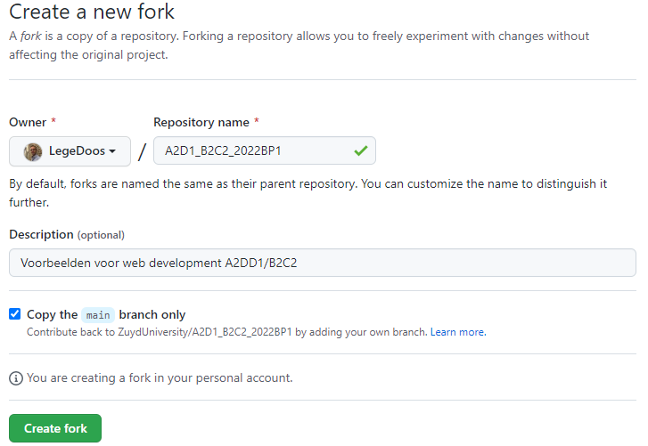
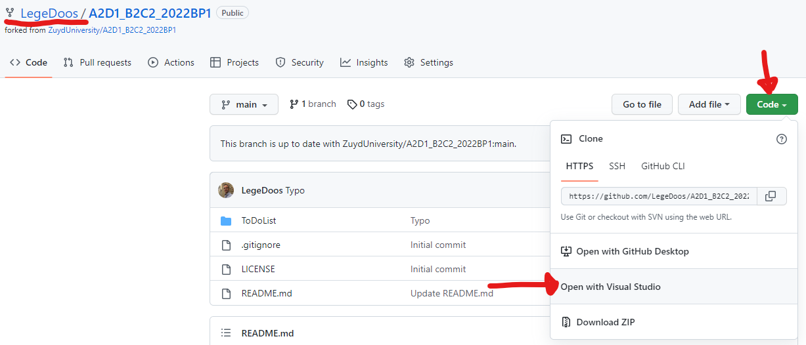
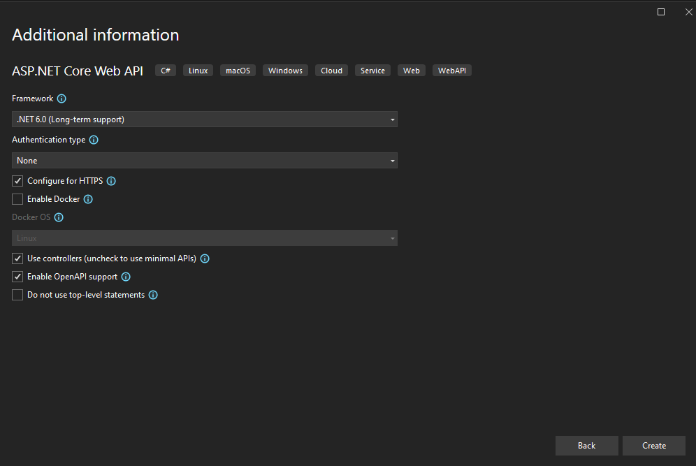

# API: ToDoList
In de map ToDoList is een eenvoudige applicatie te vinden. Met deze applicatie is het mogelijk een ToDoList bij te houden. De applicatie is ontwikkeld in .NET core 6.0. Dit is een voorbeeld van hoe een applicatie eruit zou kunnen zien in lagen. 
Zie laatste hoofdstuk hieronder met "verder lezen" links over diverse onderwerpen uit deze opdracht.

## Uitleg bestaande appplicatie
### DataLayer
De data wordt momenteel opgeslagen in een tekstbestand in json formaat. Dit is een eenvoudig opslagmechanisme en niet geschikt voor multithreading of complexe relaties zoals wel kan bij een RMDB. Voor dit voorbeeld volstaat dit. De daadwerkelijke DAL is de JsonDAL. Hierin zijn alle CRUD operaties naar de file geimplementeerd.
De json file wordt automatisch opgeslagen in je bin folder. Indien de file niet wordt gevonden, wordt dummy data aangemaakt. Wil je je data resetten, gooi dan de file gewoon weg.

Naast de DAL is er een IDataAccessLayer interface. Deze is gemaakt om in de toekomst mogelijk andere DALs te implementeren. Stel je wilt een MSSQL Dal gaan maken dan kun je dat doen op basis van de interface. Er is een DALSingleton class welke, volgens het singleton pattern, ervoor zorgt dat je je DAL niet telkens opnieuw hoeft aan te maken.

### Models
Hierin staat de enige entiteit van deze applicatie. Het is een class uitgewerkt met properties en methods. De methods (gedrag) van de class beïnvloeden de properties (status). In je eigen applicatie zou dit ook zo uit moeten zien.

### Program.cs
Dit is het programma dat momenteel alle CRUD operaties een keer uitvoert.

## Opdracht
Het is de bedoeling om voor deze bestaande applicatie een API te maken. Om dit te doen voer je de volgende stappen uit. De stappen zijn ook te zien in het filmpje. <filmpje>
  
### Om te beginnen
1.  Maak een fork van de repository door rechtsboven op de knop "Fork" te klikken en de stappen te doorlopen. Je hebt nu een kopie gemaakt van de repository in je eigen Github account.
 
2.  Haal de code binnen in Visual Studio door op "Code" > "Open in Visual Studio" te klikken.
 
3.  Bekijk de code op basis van bovenstaande uitleg. Zorg dat je snapt welke componenten er zijn en hoe het werkt. Voer de console applicatie uit en kijk of alles naar wens werkt.

### Maak de API
Zie ook het filmpje onder.
1. Maak een nieuw project in je solution. Kies voor "ASP.NET Core Web API". Let op dat je C# kiest! Geef het project een passende naam, bijvoorbeeld "ToDoAPI". Verander niets aan de standaard instellingen voor het project.
 
2. Zoek in je solution het nieuwe project op en klik met je rechtermuisknop. Kies voor "Set as startup project". Als de oplossing nu gestart wordt, zal dit het project zijn wat wordt uitgevoerd. De API zal dus starten. Valideer of dit gebeurt. 
3. Onderzoek welke componenten er zijn aangemaakt in je nieuwe project. Zorg dat je begrijpt waar alles voor dient.
4. Rechtermuisklik op de "Controllers" map en voeg een controller class toe. Kies voor "API Controller with read/write actions". Geef de controller een passende naam zoals "ToDoController". Naamgeving conventions geven aan dat je moet besluiten met "Controller".
5. Voer je applicatie opnieuw uit en zie in de Swagger UI dat je nieuwe controller mét endpoints meteen herkend worden. Er zit echter nog geen logica in de API, dus er zal nog niets zinvols gebeuren als je ze aanroept.
6. Ga naar de dependencies van het ToDoAPI project en voeg een project reference toe naar het ToDoListModel.
7. Implementeer de gegenereerde methods zodanig dat je bestaande model (Project ToDoListModel) wordt gebruikt.
8. Maak extra endpoints om een taak aan iemand te assignen en om een taak te finishen.
8. Test de API met Swagger UI.

### Verdieping statuscodes
Als je HTTP gebruikt heeft elk request een statuscode. Zie hier een lijst met statuscodes: https://en.wikipedia.org/wiki/List_of_HTTP_status_codes Zie ook https://docs.microsoft.com/en-us/dotnet/api/system.net.httpstatuscode?view=net-6.0
Zie deze documentatie voor de how-to: https://docs.microsoft.com/en-us/aspnet/core/web-api/action-return-types?view=aspnetcore-6.0
1. Pas je endpoint aan zodat het aangemaakte object wordt teruggegeven en je een bijbehorende statuscode krijgt te zien.
<filmpje>

### Verdieping API aanroepen
We hebben de API nu aangeroepen met de Swagger UI. In de praktijk zal een API aangeroepen worden door een ander systeem, bijvoorbeeld een frontend (web, mobile) of een andere applicatie.
Probeer de applicatie Postman eens om de API aan te roepen: 
Implementeer zelf een eenvoudige (console) applicatie die de API aanroept: https://docs.microsoft.com/en-us/aspnet/web-api/overview/advanced/calling-a-web-api-from-a-net-client

### Verdieping authenticatie
Onderzoek hoe je authenticatie kunt gebruiken op de API (https://docs.microsoft.com/en-us/aspnet/web-api/overview/security/authentication-and-authorization-in-aspnet-web-api). Implementeer dit zelf of probeer een nieuw API project aan te maken met authenticatie (vinkje bij maken van project). Kijk wat er gebeurt.

## Verder lezen
- Json: https://www.json.org/json-en.html
- Interface: https://docs.microsoft.com/en-us/dotnet/csharp/language-reference/keywords/interface
- Singleton pattern: https://en.wikipedia.org/wiki/Singleton_pattern
- Fork: https://docs.github.com/en/get-started/quickstart/fork-a-repo
- HTTP Status codes: https://en.wikipedia.org/wiki/List_of_HTTP_status_codes
- HTTP methods: https://en.wikipedia.org/wiki/Representational_state_transfer#Semantics_of_HTTP_methods
- Swagger: https://swagger.io/

- Alle videos: https://youtube.com/playlist?list=PLV3-439d8HgAlu3zYE61X4-qsfVz17xKL
  
  <iframe width="560" height="315" src="https://www.youtube.com/embed/videoseries?list=PLV3-439d8HgApfmaIgF_jees3k1p2n7iB" title="YouTube video player" frameborder="0" allow="accelerometer; autoplay; clipboard-write; encrypted-media; gyroscope; picture-in-picture" allowfullscreen></iframe>
